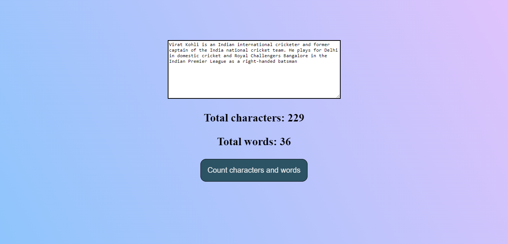

## Javascript Wordcount

### Hello, I am Dipanshu Shukla

I have build wordcount with the help of `HTML`, `CSS` and `JavaScript`.

It helps to find the word count and characters count of text which entered inside the textbox.

``` Learning Key points of Javascript```
- Use of trim() method.
- Use of split() method.
- Use of filter() method, Filter takes a function.
  
This is the live link of the project.

Checkout Here [Live Link](https://dp-js-stopwatch.netlify.app)



